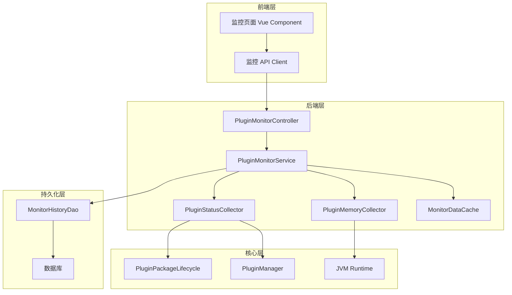

# 设计文档

## 概述

插件监控页面功能为 gress-plugin-appstore 项目提供实时的插件运行状态监控能力。该功能通过收集插件的运行时信息（启动状态、加载状态、内存使用等），并通过 REST API 和前端页面展示，帮助系统管理员和开发人员快速诊断和解决插件运行问题。

设计遵循以下原则：
- **低侵入性**: 监控功能不影响插件的正常运行
- **高性能**: 使用缓存和异步机制减少性能开销
- **可扩展性**: 支持未来添加更多监控指标
- **用户友好**: 提供直观的可视化界面和实时数据更新

## 架构

### 整体架构



### 分层说明

1. **前端层**: 负责数据展示和用户交互
   - 监控页面组件：展示插件列表和详细信息
   - API 客户端：封装与后端的通信

2. **后端层**: 负责数据收集和业务逻辑
   - Controller：处理 HTTP 请求
   - Service：协调数据收集和缓存
   - Collector：具体的数据收集器
   - Cache：缓存监控数据减少重复计算

3. **核心层**: 提供插件运行时信息
   - PluginPackageLifecycle：插件生命周期管理
   - PluginManager：插件注册和管理
   - JVM Runtime：JVM 运行时信息

4. **持久化层**: 存储历史监控数据
   - DAO：数据访问对象
   - 数据库：存储监控历史记录

## 组件和接口

### 后端组件

#### 1. PluginMonitorController

REST API 控制器，提供监控数据查询接口。

```java
@RestController
@RequestMapping("/api/plugins/appstore/monitor")
public class PluginMonitorController {
    
    @Inject
    private PluginMonitorService monitorService;
    
    /**
     * 获取所有插件的监控状态
     */
    @GetMapping("/status")
    public Result<List<PluginMonitorStatus>> getAllPluginStatus() {
        return monitorService.getAllPluginStatus();
    }
    
    /**
     * 获取单个插件的详细监控信息
     */
    @GetMapping("/status/{pluginId}")
    public Result<PluginMonitorDetail> getPluginDetail(@PathVariable String pluginId) {
        return monitorService.getPluginDetail(pluginId);
    }
    
    /**
     * 获取插件历史监控数据
     */
    @GetMapping("/history/{pluginId}")
    public Result<List<PluginMonitorHistory>> getPluginHistory(
            @PathVariable String pluginId,
            @RequestParam(defaultValue = "1h") String timeRange) {
        return monitorService.getPluginHistory(pluginId, timeRange);
    }
    
    /**
     * 获取系统监控概览
     */
    @GetMapping("/overview")
    public Result<MonitorOverview> getMonitorOverview() {
        return monitorService.getMonitorOverview();
    }
}
```

#### 2. PluginMonitorService

监控服务，协调数据收集和缓存。

```java
@Service
public class PluginMonitorService {
    
    @Inject
    private PluginStatusCollector statusCollector;
    
    @Inject
    private PluginMemoryCollector memoryCollector;
    
    @Inject
    private MonitorDataCache monitorCache;
    
    @Inject
    private MonitorHistoryDao historyDao;
    
    @Inject(source = Inject.BeanSource.SPRING)
    private PluginPackageLifecycle pluginLifecycle;
    
    /**
     * 获取所有插件的监控状态
     */
    public Result<List<PluginMonitorStatus>> getAllPluginStatus() {
        // 尝试从缓存获取
        List<PluginMonitorStatus> cached = monitorCache.getAllStatus();
        if (cached != null && !cached.isEmpty()) {
            return Result.success(cached);
        }
        
        // 收集所有插件状态
        List<PluginMonitorStatus> statusList = statusCollector.collectAllStatus();
        
        // 异步收集内存信息
        CompletableFuture.runAsync(() -> {
            for (PluginMonitorStatus status : statusList) {
                PluginMemoryInfo memInfo = memoryCollector.collectMemoryInfo(status.getPluginId());
                status.setMemoryInfo(memInfo);
            }
            // 更新缓存
            monitorCache.updateAllStatus(statusList);
        });
        
        return Result.success(statusList);
    }
    
    /**
     * 获取单个插件的详细信息
     */
    public Result<PluginMonitorDetail> getPluginDetail(String pluginId) {
        // 收集基本状态
        PluginMonitorStatus status = statusCollector.collectStatus(pluginId);
        if (status == null) {
            return Result.error("插件不存在");
        }
        
        // 收集详细信息
        PluginMonitorDetail detail = new PluginMonitorDetail();
        detail.setStatus(status);
        detail.setMemoryInfo(memoryCollector.collectMemoryInfo(pluginId));
        detail.setMetadata(pluginLifecycle.getMetadata(pluginId).getData());
        detail.setClassLoaderInfo(statusCollector.getClassLoaderInfo(pluginId));
        
        return Result.success(detail);
    }
    
    /**
     * 获取插件历史监控数据
     */
    public Result<List<PluginMonitorHistory>> getPluginHistory(String pluginId, String timeRange) {
        long startTime = parseTimeRange(timeRange);
        List<PluginMonitorHistory> history = historyDao.queryHistory(pluginId, startTime);
        return Result.success(history);
    }
    
    /**
     * 获取监控概览
     */
    public Result<MonitorOverview> getMonitorOverview() {
        List<PluginMonitorStatus> allStatus = statusCollector.collectAllStatus();
        
        MonitorOverview overview = new MonitorOverview();
        overview.setTotalPlugins(allStatus.size());
        overview.setRunningPlugins(allStatus.stream().filter(s -> "STARTED".equals(s.getState())).count());
        overview.setStoppedPlugins(allStatus.stream().filter(s -> "STOPPED".equals(s.getState())).count());
        overview.setErrorPlugins(allStatus.stream().filter(s -> s.hasError()).count());
        overview.setTotalMemoryUsage(memoryCollector.getTotalMemoryUsage());
        
        return Result.success(overview);
    }
    
    private long parseTimeRange(String timeRange) {
        // 解析时间范围（如 "1h", "24h", "7d"）
        // 返回起始时间戳
        return System.currentTimeMillis() - parseTimeRangeDuration(timeRange);
    }
}
```

#### 3. PluginStatusCollector

插件状态收集器，负责收集插件的运行状态。

```java
@Service
public class PluginStatusCollector {
    
    @Inject(source = Inject.BeanSource.SPRING)
    private PluginManager pluginManager;
    
    @Inject(source = Inject.BeanSource.SPRING)
    private ApplicationDao applicationDao;
    
    /**
     * 收集所有插件的状态
     */
    public List<PluginMonitorStatus> collectAllStatus() {
        List<SysApplication> applications = applicationDao.findAll();
        return applications.stream()
                .map(this::collectStatus)
                .filter(Objects::nonNull)
                .collect(Collectors.toList());
    }
    
    /**
     * 收集单个插件的状态
     */
    public PluginMonitorStatus collectStatus(String pluginId) {
        SysApplication app = applicationDao.findByPluginId(pluginId);
        if (app == null) {
            return null;
        }
        
        PluginMonitorStatus status = new PluginMonitorStatus();
        status.setPluginId(pluginId);
        status.setPluginName(app.getApplicationName());
        status.setPluginVersion(app.getPluginVersion());
        
        // 获取插件状态
        PluginWrapper wrapper = pluginManager.getPlugin(pluginId);
        if (wrapper != null) {
            status.setState(wrapper.getPluginState().toString());
            status.setLoaded(true);
            status.setStartTime(getPluginStartTime(wrapper));
        } else {
            status.setState("NOT_LOADED");
            status.setLoaded(false);
        }
        
        return status;
    }
    
    /**
     * 获取类加载器信息
     */
    public ClassLoaderInfo getClassLoaderInfo(String pluginId) {
        PluginWrapper wrapper = pluginManager.getPlugin(pluginId);
        if (wrapper == null) {
            return null;
        }
        
        ClassLoader classLoader = wrapper.getPluginClassLoader();
        ClassLoaderInfo info = new ClassLoaderInfo();
        info.setClassName(classLoader.getClass().getName());
        info.setParentClassName(classLoader.getParent().getClass().getName());
        
        return info;
    }
    
    private Long getPluginStartTime(PluginWrapper wrapper) {
        // 从插件包元数据或缓存中获取启动时间
        return null; // 需要实现
    }
}
```

#### 4. PluginMemoryCollector

插件内存收集器，负责收集插件的内存使用信息。

```java
@Service
public class PluginMemoryCollector {
    
    @Inject(source = Inject.BeanSource.SPRING)
    private PluginManager pluginManager;
    
    private final Runtime runtime = Runtime.getRuntime();
    
    /**
     * 收集插件内存信息
     */
    public PluginMemoryInfo collectMemoryInfo(String pluginId) {
        PluginWrapper wrapper = pluginManager.getPlugin(pluginId);
        if (wrapper == null) {
            return null;
        }
        
        PluginMemoryInfo memInfo = new PluginMemoryInfo();
        
        // 估算插件内存使用（通过类加载器加载的类）
        long estimatedMemory = estimatePluginMemory(wrapper);
        memInfo.setUsedMemory(estimatedMemory);
        memInfo.setFormattedMemory(formatMemorySize(estimatedMemory));
        
        // JVM 总内存信息
        memInfo.setTotalJvmMemory(runtime.totalMemory());
        memInfo.setFreeJvmMemory(runtime.freeMemory());
        memInfo.setMaxJvmMemory(runtime.maxMemory());
        
        return memInfo;
    }
    
    /**
     * 获取所有插件的总内存使用
     */
    public long getTotalMemoryUsage() {
        return pluginManager.getPlugins().stream()
                .mapToLong(wrapper -> estimatePluginMemory(wrapper))
                .sum();
    }
    
    /**
     * 估算插件内存使用
     * 
     * 注意：这是一个估算值，实际内存使用可能不同
     * 计算方法：统计插件类加载器加载的类数量 * 平均类大小
     */
    private long estimatePluginMemory(PluginWrapper wrapper) {
        try {
            ClassLoader classLoader = wrapper.getPluginClassLoader();
            // 使用 Instrumentation API 或反射获取加载的类
            // 这里简化处理，返回估算值
            return 10 * 1024 * 1024; // 默认 10MB
        } catch (Exception e) {
            return 0;
        }
    }
    
    /**
     * 格式化内存大小
     */
    private String formatMemorySize(long bytes) {
        if (bytes < 1024) {
            return bytes + " B";
        } else if (bytes < 1024 * 1024) {
            return String.format("%.2f KB", bytes / 1024.0);
        } else if (bytes < 1024 * 1024 * 1024) {
            return String.format("%.2f MB", bytes / (1024.0 * 1024));
        } else {
            return String.format("%.2f GB", bytes / (1024.0 * 1024 * 1024));
        }
    }
}
```

#### 5. MonitorDataCache

监控数据缓存，减少重复计算。

```java
@Service
public class MonitorDataCache {
    
    private final Map<String, PluginMonitorStatus> statusCache = new ConcurrentHashMap<>();
    private volatile long lastUpdateTime = 0;
    private static final long CACHE_TTL = 5000; // 5秒缓存过期
    
    /**
     * 获取所有插件状态（从缓存）
     */
    public List<PluginMonitorStatus> getAllStatus() {
        if (System.currentTimeMillis() - lastUpdateTime > CACHE_TTL) {
            return null; // 缓存过期
        }
        return new ArrayList<>(statusCache.values());
    }
    
    /**
     * 更新所有插件状态缓存
     */
    public void updateAllStatus(List<PluginMonitorStatus> statusList) {
        statusCache.clear();
        for (PluginMonitorStatus status : statusList) {
            statusCache.put(status.getPluginId(), status);
        }
        lastUpdateTime = System.currentTimeMillis();
    }
    
    /**
     * 获取单个插件状态（从缓存）
     */
    public PluginMonitorStatus getStatus(String pluginId) {
        if (System.currentTimeMillis() - lastUpdateTime > CACHE_TTL) {
            return null; // 缓存过期
        }
        return statusCache.get(pluginId);
    }
    
    /**
     * 清除缓存
     */
    public void clearCache() {
        statusCache.clear();
        lastUpdateTime = 0;
    }
}
```

#### 6. MonitorHistoryDao

监控历史数据访问对象。

```java
@Dao
public interface MonitorHistoryDao {
    
    /**
     * 保存监控快照
     */
    void saveSnapshot(PluginMonitorSnapshot snapshot);
    
    /**
     * 查询历史监控数据
     */
    List<PluginMonitorHistory> queryHistory(String pluginId, long startTime);
    
    /**
     * 删除过期数据
     */
    int deleteExpiredData(long expireTime);
}
```

### 前端组件

#### 1. PluginMonitorDashboard.vue

监控页面主组件。

```vue
<template>
  <div class="plugin-monitor-dashboard">
    <!-- 概览卡片 -->
    <div class="overview-cards">
      <n-card title="总插件数">
        <n-statistic :value="overview.totalPlugins" />
      </n-card>
      <n-card title="运行中">
        <n-statistic :value="overview.runningPlugins" />
      </n-card>
      <n-card title="已停止">
        <n-statistic :value="overview.stoppedPlugins" />
      </n-card>
      <n-card title="异常">
        <n-statistic :value="overview.errorPlugins" />
      </n-card>
    </div>
    
    <!-- 刷新控制 -->
    <div class="refresh-controls">
      <n-button @click="refreshData">手动刷新</n-button>
      <n-switch v-model:value="autoRefresh" @update:value="toggleAutoRefresh">
        自动刷新
      </n-switch>
      <span v-if="autoRefresh">每 {{ refreshInterval / 1000 }} 秒</span>
    </div>
    
    <!-- 插件列表 -->
    <n-data-table
      :columns="columns"
      :data="pluginList"
      :loading="loading"
      :pagination="pagination"
      @update:expanded-row-keys="handleExpand"
    />
    
    <!-- 详情抽屉 -->
    <n-drawer v-model:show="showDetail" :width="600">
      <n-drawer-content title="插件详情">
        <plugin-monitor-detail :plugin-id="selectedPluginId" />
      </n-drawer-content>
    </n-drawer>
  </div>
</template>

<script setup lang="ts">
import { ref, onMounted, onUnmounted } from 'vue'
import { pluginMonitorApi } from '../api/pluginMonitor'
import type { PluginMonitorStatus, MonitorOverview } from '../types/pluginMonitor'

const pluginList = ref<PluginMonitorStatus[]>([])
const overview = ref<MonitorOverview>({
  totalPlugins: 0,
  runningPlugins: 0,
  stoppedPlugins: 0,
  errorPlugins: 0,
  totalMemoryUsage: 0
})
const loading = ref(false)
const autoRefresh = ref(false)
const refreshInterval = ref(5000)
let refreshTimer: number | null = null

const columns = [
  { title: '插件ID', key: 'pluginId' },
  { title: '插件名称', key: 'pluginName' },
  { title: '版本', key: 'pluginVersion' },
  { title: '状态', key: 'state', render: renderState },
  { title: '加载状态', key: 'loaded', render: renderLoaded },
  { title: '内存使用', key: 'memoryInfo.formattedMemory' },
  { title: '操作', key: 'actions', render: renderActions }
]

async function refreshData() {
  loading.value = true
  try {
    const [statusData, overviewData] = await Promise.all([
      pluginMonitorApi.getAllStatus(),
      pluginMonitorApi.getOverview()
    ])
    pluginList.value = statusData
    overview.value = overviewData
  } catch (error) {
    console.error('刷新监控数据失败:', error)
  } finally {
    loading.value = false
  }
}

function toggleAutoRefresh(enabled: boolean) {
  if (enabled) {
    refreshTimer = window.setInterval(refreshData, refreshInterval.value)
  } else {
    if (refreshTimer) {
      clearInterval(refreshTimer)
      refreshTimer = null
    }
  }
}

onMounted(() => {
  refreshData()
})

onUnmounted(() => {
  if (refreshTimer) {
    clearInterval(refreshTimer)
  }
})
</script>
```

#### 2. pluginMonitor.ts (API Client)

前端 API 客户端。

```typescript
import { http } from './http'
import type {
  PluginMonitorStatus,
  PluginMonitorDetail,
  PluginMonitorHistory,
  MonitorOverview
} from '../types/pluginMonitor'

const API_BASE = '/plugins/appstore/monitor'

export const pluginMonitorApi = {
  /**
   * 获取所有插件状态
   */
  getAllStatus(): Promise<PluginMonitorStatus[]> {
    return http.get<PluginMonitorStatus[]>(`${API_BASE}/status`)
  },
  
  /**
   * 获取单个插件详情
   */
  getDetail(pluginId: string): Promise<PluginMonitorDetail> {
    return http.get<PluginMonitorDetail>(`${API_BASE}/status/${pluginId}`)
  },
  
  /**
   * 获取插件历史数据
   */
  getHistory(pluginId: string, timeRange: string = '1h'): Promise<PluginMonitorHistory[]> {
    return http.get<PluginMonitorHistory[]>(`${API_BASE}/history/${pluginId}`, { timeRange })
  },
  
  /**
   * 获取监控概览
   */
  getOverview(): Promise<MonitorOverview> {
    return http.get<MonitorOverview>(`${API_BASE}/overview`)
  }
}
```

## 数据模型

### PluginMonitorStatus

插件监控状态数据模型。

```java
public class PluginMonitorStatus {
    private String pluginId;           // 插件ID
    private String pluginName;         // 插件名称
    private String pluginVersion;      // 插件版本
    private String state;              // 运行状态: STARTED, STOPPED, CREATED, DISABLED
    private Boolean loaded;            // 是否已加载
    private Long startTime;            // 启动时间戳
    private Long uptime;               // 运行时长（毫秒）
    private PluginMemoryInfo memoryInfo; // 内存信息
    private Boolean hasError;          // 是否有错误
    private String errorMessage;       // 错误信息
}
```

### PluginMemoryInfo

插件内存信息数据模型。

```java
public class PluginMemoryInfo {
    private Long usedMemory;           // 插件使用的内存（字节）
    private String formattedMemory;    // 格式化的内存大小（如 "10.5 MB"）
    private Long totalJvmMemory;       // JVM 总内存
    private Long freeJvmMemory;        // JVM 空闲内存
    private Long maxJvmMemory;         // JVM 最大内存
}
```

### PluginMonitorDetail

插件监控详情数据模型。

```java
public class PluginMonitorDetail {
    private PluginMonitorStatus status;           // 基本状态
    private PluginMemoryInfo memoryInfo;          // 内存信息
    private PluginPackageMetadataResult metadata; // 插件元数据
    private ClassLoaderInfo classLoaderInfo;      // 类加载器信息
    private Map<String, Object> configuration;    // 插件配置
}
```

### MonitorOverview

监控概览数据模型。

```java
public class MonitorOverview {
    private Integer totalPlugins;      // 总插件数
    private Long runningPlugins;       // 运行中插件数
    private Long stoppedPlugins;       // 已停止插件数
    private Long errorPlugins;         // 异常插件数
    private Long totalMemoryUsage;     // 总内存使用
}
```

### PluginMonitorSnapshot

监控快照数据模型（用于持久化）。

```java
public class PluginMonitorSnapshot {
    private Long id;
    private String pluginId;
    private String state;
    private Long memoryUsage;
    private Long timestamp;
    private String metadata;           // JSON 格式的额外信息
}
```

### 数据库表设计

```sql
-- 插件监控快照表
CREATE TABLE plugin_monitor_snapshot (
    id BIGINT PRIMARY KEY AUTO_INCREMENT,
    plugin_id VARCHAR(100) NOT NULL,
    state VARCHAR(20) NOT NULL,
    memory_usage BIGINT,
    timestamp BIGINT NOT NULL,
    metadata TEXT,
    INDEX idx_plugin_timestamp (plugin_id, timestamp),
    INDEX idx_timestamp (timestamp)
);

-- 插件状态变更日志表
CREATE TABLE plugin_state_change_log (
    id BIGINT PRIMARY KEY AUTO_INCREMENT,
    plugin_id VARCHAR(100) NOT NULL,
    old_state VARCHAR(20),
    new_state VARCHAR(20) NOT NULL,
    change_time BIGINT NOT NULL,
    operator VARCHAR(50),
    reason TEXT,
    INDEX idx_plugin_time (plugin_id, change_time)
);
```

## 错误处理

### 错误类型

1. **插件不存在错误**
   - 场景：查询不存在的插件
   - 处理：返回 404 错误码和友好提示

2. **数据收集超时错误**
   - 场景：收集监控数据超时
   - 处理：返回部分数据，标记超时插件

3. **内存信息不可用错误**
   - 场景：无法获取插件内存信息
   - 处理：显示"不可用"，不影响其他数据

4. **缓存失效错误**
   - 场景：缓存数据过期或损坏
   - 处理：重新收集数据，更新缓存

5. **数据库访问错误**
   - 场景：查询历史数据失败
   - 处理：返回错误信息，不影响实时监控

### 错误处理策略

```java
public class MonitorErrorHandler {
    
    /**
     * 处理数据收集错误
     */
    public PluginMonitorStatus handleCollectionError(String pluginId, Exception e) {
        log.error("收集插件监控数据失败: pluginId={}", pluginId, e);
        
        PluginMonitorStatus status = new PluginMonitorStatus();
        status.setPluginId(pluginId);
        status.setHasError(true);
        status.setErrorMessage("数据收集失败: " + e.getMessage());
        
        return status;
    }
    
    /**
     * 处理超时错误
     */
    public void handleTimeout(String pluginId) {
        log.warn("收集插件监控数据超时: pluginId={}", pluginId);
        // 记录超时事件，但不中断整体流程
    }
    
    /**
     * 处理内存信息不可用
     */
    public PluginMemoryInfo handleMemoryUnavailable(String pluginId) {
        PluginMemoryInfo memInfo = new PluginMemoryInfo();
        memInfo.setFormattedMemory("不可用");
        return memInfo;
    }
}
```

## 测试策略

### 单元测试

测试各个组件的独立功能：

1. **PluginStatusCollector 测试**
   - 测试收集单个插件状态
   - 测试收集所有插件状态
   - 测试插件不存在的情况
   - 测试类加载器信息获取

2. **PluginMemoryCollector 测试**
   - 测试内存信息收集
   - 测试内存大小格式化
   - 测试总内存使用计算
   - 测试内存信息不可用的情况

3. **MonitorDataCache 测试**
   - 测试缓存存储和读取
   - 测试缓存过期机制
   - 测试并发访问安全性

4. **PluginMonitorService 测试**
   - 测试获取所有插件状态
   - 测试获取单个插件详情
   - 测试历史数据查询
   - 测试监控概览生成

### 集成测试

测试组件之间的协作：

1. **API 集成测试**
   - 测试 Controller 到 Service 的完整调用链
   - 测试 API 响应格式和状态码
   - 测试错误处理和异常情况

2. **数据持久化测试**
   - 测试监控快照保存
   - 测试历史数据查询
   - 测试过期数据清理

3. **前后端集成测试**
   - 测试前端 API 调用
   - 测试数据格式兼容性
   - 测试实时刷新功能

### 性能测试

测试监控功能的性能影响：

1. **响应时间测试**
   - 测试单个插件状态查询响应时间 < 50ms
   - 测试 100 个插件状态查询响应时间 < 2s
   - 测试并发请求处理能力

2. **资源占用测试**
   - 测试监控服务的 CPU 占用 < 5%
   - 测试监控服务的内存占用 < 100MB
   - 测试缓存大小和清理机制

3. **压力测试**
   - 测试高频刷新场景（每秒 10 次）
   - 测试大量插件场景（1000+ 插件）
   - 测试长时间运行稳定性


## Correctness Properties

属性是一种特征或行为，应该在系统的所有有效执行中保持为真——本质上是关于系统应该做什么的形式化陈述。属性作为人类可读规范和机器可验证正确性保证之间的桥梁。

### Property 1: 插件列表渲染完整性

*对于任意* 插件状态数据集合，渲染的插件列表中每个插件条目都应包含插件ID、名称、版本和运行状态信息。

**验证: 需求 1.2, 1.3**

### Property 2: 插件状态更新一致性

*对于任意* 插件，当其状态发生变化后，下次刷新获取的监控数据应反映最新的状态。

**验证: 需求 1.4**

### Property 3: 插件加载状态检测正确性

*对于任意* 插件ID，查询加载状态时，如果插件在 PluginManager 中注册则返回"已加载"，否则返回"未加载"。

**验证: 需求 2.1, 2.2, 2.3**

### Property 4: 类加载器信息完整性

*对于任意* 已加载的插件，显示加载状态时应同时包含类加载器的类名和父类加载器信息。

**验证: 需求 2.5**

### Property 5: 内存使用计算有效性

*对于任意* 已加载的插件，查询内存使用时应返回非负的内存值（字节数）。

**验证: 需求 3.1**

### Property 6: 内存大小格式化正确性

*对于任意* 内存大小（字节数），格式化后的字符串应符合以下规则：
- 小于 1024 字节显示为 "X B"
- 小于 1MB 显示为 "X.XX KB"
- 小于 1GB 显示为 "X.XX MB"
- 大于等于 1GB 显示为 "X.XX GB"

**验证: 需求 3.2**

### Property 7: 内存告警阈值检测

*对于任意* 插件，当其内存使用超过配置的阈值（默认 500MB）时，显示时应包含警告标识。

**验证: 需求 3.3, 8.2**

### Property 8: JVM 内存信息完整性

*对于任意* 内存信息查询，返回的数据应同时包含 JVM 总内存、空闲内存和最大内存信息。

**验证: 需求 3.5**

### Property 9: 插件详情渲染完整性

*对于任意* 插件，查询详细信息时应包含以下所有字段：基本状态、内存信息、元数据（作者、描述、主页）、依赖信息、配置信息、启动时间和运行时长。

**验证: 需求 4.2, 4.3, 4.4, 4.5**

### Property 10: API 响应格式一致性

*对于任意* 监控 API 调用（成功情况），返回的响应应为有效的 JSON 格式，并包含 success 字段和 data 字段。

**验证: 需求 6.3**

### Property 11: API 响应时间性能

*对于任意* 单个插件的监控数据查询，响应时间应在 200ms 以内（在正常负载下）。

**验证: 需求 6.4**

### Property 12: API 错误响应完整性

*对于任意* 监控 API 调用失败的情况，返回的错误响应应包含适当的 HTTP 状态码（4xx 或 5xx）和错误信息字段。

**验证: 需求 6.5**

### Property 13: 状态变更记录完整性

*对于任意* 插件状态变化事件，记录的状态变更日志应包含时间戳、插件ID、旧状态和新状态四个字段。

**验证: 需求 7.1, 7.2**

### Property 14: 历史数据保留策略

*对于任意* 时间点，数据库中保留的监控历史数据应仅包含最近 7 天内的记录，超过 7 天的数据应被清理。

**验证: 需求 7.4**

### Property 15: 错误状态显示一致性

*对于任意* 处于错误状态的插件（启动失败或运行异常），监控页面应显示错误标识，并提供查看详细错误信息的入口。

**验证: 需求 2.4, 8.1, 8.4**

### Property 16: 异常插件统计准确性

*对于任意* 插件状态数据集合，显示的异常插件数量应等于状态为错误或异常的插件数量。

**验证: 需求 8.3**

### Property 17: 跨设备数据一致性

*对于任意* 设备或浏览器，在相同时间点查询的监控数据应返回相同的结果（数据一致性）。

**验证: 需求 9.5**

### Property 18: 单插件数据采集性能

*对于任意* 单个插件，收集其监控数据（状态、内存等）的操作应在 50ms 内完成（在正常负载下）。

**验证: 需求 10.1**

### Property 19: 批量数据采集性能

*对于任意* 包含 100 个插件的系统，收集所有插件的监控数据并返回响应应在 2 秒内完成（在正常负载下）。

**验证: 需求 10.2**

### Property 20: 监控服务故障隔离

*对于任意* 监控服务异常或失败的情况，插件的正常运行（启动、停止、执行业务逻辑）不应受到影响。

**验证: 需求 10.5**

### 属性测试说明

以上属性应通过以下方式测试：

1. **功能属性（Property 1-10, 13-17）**: 使用属性测试框架（如 JUnit + QuickCheck 或 Hypothesis）生成随机测试数据，验证属性在所有情况下都成立。

2. **性能属性（Property 11, 18, 19）**: 使用性能测试工具（如 JMeter 或 Gatling）在受控环境下测量响应时间，验证性能指标。

3. **隔离性属性（Property 20）**: 通过故障注入测试，模拟监控服务异常，验证插件功能不受影响。

4. **边界条件测试**: 对于格式化、阈值检测等属性，特别测试边界值（如 1023 字节、1024 字节、500MB 等）。
